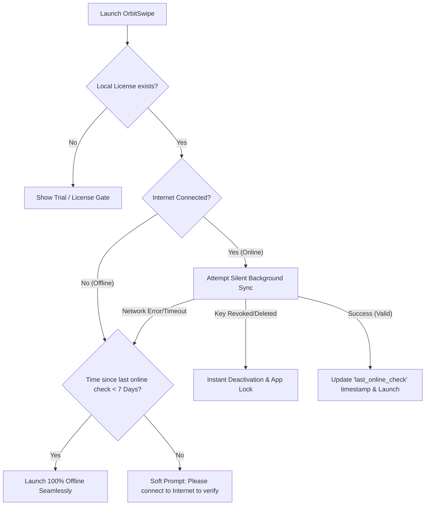

# Industry-Grade Offline Lease & Background Sync Architecture

This plan describes how we will implement an **Industry-Grade License Verification System** that prevents offline launch blockage while securing the application against deleted or revoked keys.

## 1. How Premium Software Handles Licensing
Premium desktop applications (e.g., JetBrains, Adobe, MS Office) balance security with a smooth offline user experience using a **Grace Period Offline Lease** system:



---

## 2. Core Concepts of the Design

### A. Offline Grace Period (Lease Token)
When the license is activated, we store two timestamps in the encrypted [`license.json`](file:///c:/Users/ENVY%20X360/Downloads/New%20folder/orbitswipe/core/license.py):
1. `activated_at`: When the license was first registered.
2. `last_online_check`: The last timestamp when OrbitSwipe successfully verified the key with the server.

We define an **Offline Grace Period** constant (e.g., **7 Days**):
```python
OFFLINE_GRACE_PERIOD = 7 * 86400  # 7 days in seconds
```

### B. Smart Error Separation
We differentiate between two types of connection failures:
* **Connection Failure (User Offline):** The server could not be reached (DNS error, timeout). **Do not lock the app.** Let the user run offline within the 7-day grace period.
* **Explicit Revocation (Invalid Key):** The server responded successfully but said `valid: False`. This means the admin explicitly deleted or banned the key in Firebase. **Lock the app and delete local files immediately.**

---

## 3. Implementation Details

### File Changes

#### 1. [`core/license.py`](file:///c:/Users/ENVY%20X360/Downloads/New%20folder/orbitswipe/core/license.py)
We will introduce `check_license_online_silent()` with the following robust logic:

```python
def check_license_online_silent():
    data = _read_lic_file(LICENSE_FILE)
    if not data:
        return {"valid": False, "status": "no_license"}
        
    key = data.get("key")
    if not key:
        return {"valid": False, "status": "no_key"}
        
    # Attempt to validate online
    result = _validate_license_online(key)
    
    # CASE A: Explicit Revocation (Server says invalid, not a network error)
    if result.get("valid") is False and "Network error" not in result.get("message", ""):
        _log("License explicitly revoked/deleted by database server. Deactivating...")
        deactivate_license()
        return {"valid": False, "status": "revoked"}
        
    # CASE B: Online Validation Successful
    elif result.get("valid") is True:
        _log("License silently verified online. Resetting lease timer.")
        data["last_online_check"] = time.time()
        _write_lic_file(LICENSE_FILE, data)
        return {"valid": True, "status": "verified"}
        
    # CASE C: Network Down / Offline Launch
    else:
        last_check = data.get("last_online_check", data.get("activated_at", 0))
        elapsed = time.time() - last_check
        
        if elapsed < OFFLINE_GRACE_PERIOD:
            days_left = int((OFFLINE_GRACE_PERIOD - elapsed) / 86400)
            _log(f"Offline launch approved. {days_left} days remaining on lease.")
            return {"valid": True, "status": "offline_approved"}
        else:
            _log("Offline grace period expired. Internet required for verification.")
            return {"valid": False, "status": "offline_expired"}
```

#### 2. [`ui/launcher.py`](file:///c:/Users/ENVY%20X360/Downloads/New%20folder/orbitswipe/ui/launcher.py)
We will wire the background task to run asynchronously inside `_check_trial` (which ticks every 5 minutes):
1. **Startup Check:** 10 seconds after first open, trigger the silent sync in a background daemon thread.
2. **Periodic Check:** Every 6 hours, check if internet is available to silently refresh the `last_online_check` lease.
3. **If explicitly revoked:** Immediately trigger UI lockout (show Trial Gate Dialog) and pop a clean warning.

---

### E. Global Deactivation & Revocation Shield (May 2026 Update)
We implemented a global interceptor in the Vercel backend (`api/validate.js`) to block deactivated, refunded, or revoked license keys instantly, regardless of the license type (`lifetime` or `annual`).

#### Backend Code Implementation:
At the very entry point of key validation, before checking expiration dates or variant rules, we enforce status blocking:
```javascript
if (data.status === 'expired' || data.status === 'revoked' || data.status === 'disabled') {
  return res.status(200).json({ 
    valid: false, 
    message: 'This license key has been deactivated or expired. Please purchase a new license key.' 
  });
}
```
This guarantees that as soon as a key is disabled in Lemon Squeezy (setting the database state to `expired`), the desktop client will lock the app during its next silent startup check or 6-hour background sync.

