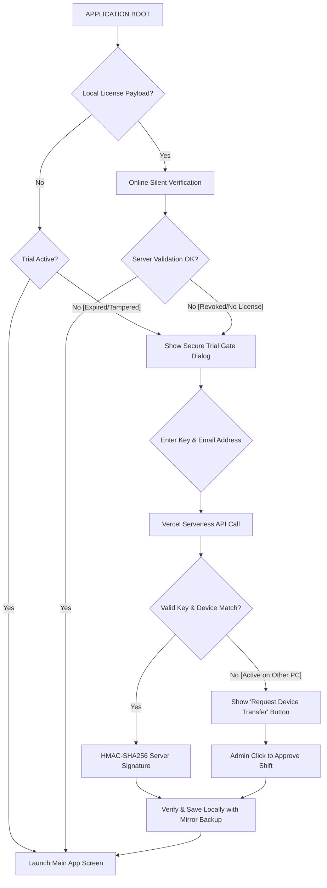
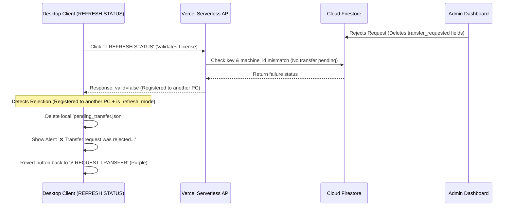

# OrbitSwipe — এন্টারপ্রাইজ লাইসেন্স ও পাইথন কোড সিকিউরিটি আর্কিটেকচার ব্লুপ্রিন্ট

এই ডকুমেন্টটিতে **OrbitSwipe**-এর জন্য ডিজাইন, ইমপ্লিমেন্ট ও ডিপ্লয় করা এন্টারপ্রাইজ-গ্রেড লাইসেন্সিংシステム, ট্রায়াল ইভ্যালুয়েশন, সেলফ-হিলিং (Self-healing) ডেটা স্টোরেজ, সার্ভারলেস ভ্যালিডেশন ব্যাকএন্ড এবং **PyArmor** পাইথন কোড প্রোটেকশন ও বাইটকোড অবফাসকেশনের সম্পূর্ণ ইন-ডেপথ মেকানিজম সংকলন করা হয়েছে।

---

## ১. উচ্চ-স্তরের সিকিউরিটি ভেরিফিকেশন ফ্লো (High-Level Verification Loop)

নিচে অরবিটসোয়াইপ অ্যাপ্লিকেশনের লাইভ অনলাইন এবং লাইসেন্স গেटिंग সিস্টেমের সিকিউরিটি ফ্লোচার্ট দেওয়া হলো:



---

## ২. কোড সিকিউরিটি ও রিভার্স-ইঞ্জিনিয়ারিং প্রোটেকশন (PyArmor Obfuscation)

পাইথন একটি ইন্টারপ্রেটেড ল্যাংগুয়েজ হওয়ায় এর সোর্স কোড (.py ফাইলসমূহ) খুব সহজেই ওপেন বা ডিকম্পাইল করা যায়। ক্র্যাকাররা যাতে **uncompyle6**, **pycdc (Decompyle++)** বা অন্য কোনো ডিকম্পাইলার ব্যবহার করে কোড উন্মুক্ত করে লাইসেন্স চেকটি বাইপাস বা ডিলিট করতে না পারে, সেজন্য আমরা **PyArmor** প্রোটেকশন সিস্টেম ব্যবহার করে সম্পূর্ণ সোর্স কোড সুরক্ষিত করেছি।

### ক. পাইআর্মোর কোড প্রোটেকশন মেকানিজম (PyArmor Security Layers)
আমরা সোর্স কোডকে সরাসরি বাইনারি ফরম্যাটে রূপান্তরিত করার জন্য পাইআর্মোরের উন্নত অবফাসকেশন রুলস ব্যবহার করেছি:

1. **বয়লারপ্লেট ও বাইটকোড এনক্রিপশন (Bytecode Encryption)**: পাইআর্মোর পাইথনের প্রতিটি ফাংশনের মূল বাইটকোডকে ক্রিপ্টোগ্রাফিক অ্যালগরিদম দ্বারা এনক্রিপ্ট করে রাখে। অ্যাপ্লিকেশন যখন রান করে, তখন কেবল রানটাইমে মেমরির ভেতরে ফাংশন এক্সিকিউট হওয়ার ঠিক পূর্ব মুহূর্তে তা ডিক্রিপ্ট হয় এবং এক্সিকিউশন শেষ হওয়ার সাথে সাথে মেমরি থেকে মুছে যায়।
2. **অবফাসকেটেড ভার্চুয়াল মেশিন (PyArmor Runtime VM)**: পাইআর্মোর অ্যাপ্লিকেশনের ভেতরে একটি নিজস্ব ডাইনামিক লাইব্রেরি (.dll বা .pyd) আকারে একটি লাইভ রানটাইম ভার্চুয়াল মেশিন যুক্ত করে দেয়। এই ভার্চুয়াল মেশিনটি রানটাইমে পাইথন ইন্টারপ্রেটারকে হুক করে রাখে এবং যেকোনো ডিবাগিং টুল বা মেমরি ডাম্পিং সনাক্ত করলে সাথে সাথে প্রসেসটি কিল করে দেয়।
3. **ফাংশন অবফাসকেশন এবং জিট কম্পাইলেশন (JIT & Obfuscated Functions)**: কোডের সমস্ত গ্লোবাল ভ্যারিয়েবল ও ইন্টারনাল ফাংশনকে এমনভাবে ম্যঙ্গেলড (Mangling) করা হয়, যার ফলে ডিকম্পাইলারগুলো সোর্স কোড রিড করতে গেলে সম্পূর্ণ ক্র্যাশ করে বা অর্থহীন ডেটা জেনারেট করে।

---

## ৩. লোকাল পিসি সিকিউরিটি ও নোড-লকিং মেকানিজম

### ক. উইন্ডোজ হার্ডওয়্যার ফিঙ্গারপ্রিন্টিং (Stable Hardware Fingerprinting)
লাইসেন্স কী-টি নোড-লকড (Node-locked) করার জন্য লোকাল কম্পিউটারের হার্ডওয়্যারের ওপর ভিত্তি করে একটি ইউনিক ও স্থায়ী **Machine ID** জেনারেট করা হয়:
* **ধাপ ১**: উইন্ডোজের GUID রিড করা হয় (`MachineGuid`):
  * **রেজিস্ট্রি পাথ**: `HKEY_LOCAL_MACHINE\SOFTWARE\Microsoft\Cryptography`
* **ধাপ ২**: এর সাথে হোস্ট পিসির ইউনিক উইন্ডোজ কম্পিউটার নাম `GetComputerNameW` যুক্ত করা হয়।
* **ধাপ ৩**: এই কম্বাইন্ড স্ট্রিংটিকে SHA-256 অ্যালগরিদমের মাধ্যমে হ্যাশ করে একটি ৩২-ক্যারেক্টার বিশিষ্ট হেক্স স্ট্রিং জেনারেট করা হয়।

---

## ৪. ৪-স্তরের সেলф-হিলিং কনসেনসাস ট্রায়াল স্টোরেজ (Stealth Mirror Storage)

ব্যবহারকারী যাতে ট্রায়াল পিরিয়ড এডিট বা বাইপাস করতে না পারে, সেজন্য আমরা উইন্ডোজের ৪টি ভিন্ন গভীর স্তরে ট্রায়ালের তারিখটি এনক্রিপ্টেড ও সিকিউর মিরর অবস্থায় সংরক্ষণ করেছি:

| লেয়ার | সোর্স টাইপ | পাথ / অবস্থান | এনক্রিপশন মেথড |
| :--- | :--- | :--- | :--- |
| **১. সাধারণ রেজিস্ট্রি** | Registry | `HKCU\Software\OrbitSwipe\TrialStart` | Hardware Bound XOR |
| **২. গভীর স্টিলথ রেজিস্ট্রি** | Registry | `HKCU\Software\Classes\CLSID\{B54F3741-5B07-4214-BE35-A43A6B64C001}\SysState` | Hardware Bound XOR |
| **৩. স্টিলথ ড্রাইভ ফাইল** | File | `%APPDATA%\Microsoft\Protect\sys_info.db` | Hardware Bound XOR |
| **৪. লোকাল ডাটা ফাইল** | File | `%LOCALAPPDATA%\OrbitSwipe\trial.dat` | Hardware Bound XOR |

### সেলফ-হিলিং ডাবল-কোর রিকভারি (Self-Healing Consensus Logic)
APPLICATION চালু হওয়ার সময় ৪টি লোকেশন থেকেই ট্রায়ালের তারিখ রিড করে। যদি কোনো হ্যাকার যেকোনো ২ বা ৩টি লেয়ার ম্যানুয়ালি মুছে ফেলে বা এডিট করে, তবে অ্যাপ্লিকেশন কনসেনসাস মেথড দিয়ে বাকি লেয়ার থেকে ওল্ডেস্ট ভ্যালিড তারিখটি রিড করে ক্ষতিগ্রস্ত হওয়া লেয়ারগুলো স্বয়ংক্রিয়ভাবে রিপেয়ার ও রিকভার করে নেয়।

---

## ৫. ডাবল-কী ক্রিপ্টোগ্রাফিক লাইসেন্স প্রোটোকল

লাইসেন্স ফাইল টেম্পারিং প্রতিরোধ করতে লোকাল পেলোড ফাইল এবং উইন্ডোজ রেজিস্ট্রির ভেতর একসাথে পেলোড ব্যাকআপ রাখা হয়:
1. **লোকাল ফাইল পাথ**: `%APPDATA%\OrbitSwipe\license.dat` (উইন্ডোজ হিডেন এট্রিবিউটসহ এনক্রিপ্টেড ফাইল)
2. **রেজিস্ট্রি স্টিলথ কি**: `HKEY_CURRENT_USER\Software\Classes\CLSID\{B54F3741-5B07-4214-BE35-A43A6B64C002}\LicToken`

#### ক্রিপ্টোগ্রাফিক সিগনেচার ভেরিফিকেশন (HMAC Security):
* প্রতিটি পেলোড এক্সওআর (XOR) সাইফার দিয়ে লোকাল পিসির ইউনিক `Machine ID` ব্যবহার করে এনক্রিপ্ট করা হয়।
* প্রতিটি পেলোডের ক্রিপ্টোগ্রাফিক সিগনেচার SHA-256 HMAC মেকানিজমে সাইন করে রাখা হয়:
  * সল্ট (Salt): `0rb1tSw1p3_X9#mK$vP2@qL7!nR4&wZ`

---

## ৬. ভার্সেল সার্ভারলেস ব্যাকএন্ড গেটওয়ে ও ক্রিপ্টোগ্রাফিক এপিআই ভ্যালিডেশন

ক্লায়েন্ট অ্যাপ্লিকেশনটি কখনো সরাসরি ফায়ারবেস ডেটাবেসের সাথে সংযুক্ত হয় না। এটি একটি ভার্সেল সার্ভারলেস ব্যাকএন্ডের সাথে যোগাযোগ করে:

* **এপিআই এন্ডপয়েন্ট**: `https://cross-tech-admin.vercel.app/api/validate`
* **HMAC ক্রিপ্টোগ্রাফিক সল্ট**: `0rb1tSw1p3_X9#mK$vP2@qL7!nR4&wZ`

### জিরো ট্রাস্ট সিগনেচার ভেরিফিকেশন (Zero Trust Signature):
কোনো ডিভাইস লাইসেন্স কী দিয়ে অ্যাক্টিভেশন রিকোয়েস্ট পাঠালে ভার্সেল ব্যাকএন্ড ফায়ারবেস Firestore থেকে ভ্যালিডেট করে সফল রেসপন্সের ডাটাটি `True:{key}:{machine_id}:{license_type}` ফরম্যাটে সাইন করে ক্লায়েন্টকে পাঠায়। 

---

## ৭. ভেরিফিকেশন এবং টেস্ট করার লাইসেন্স কীসমূহ (Firebase Test Keys)

আপনার ফায়ারবেস ফায়ারস্টোর ডাটাবেসে `orbitswipe_keys` কালেকশনে পরীক্ষার জন্য নিচের ৩টি লাইসেন্স কী সক্রিয় অবস্থায় প্রস্তুত রাখা হয়েছে:
* `FIREBASE-TEST-1234` (টেস্ট অ্যাক্টিভেশনের জন্য প্রস্তুত)
* `ORBITSWIPE-PRO-5678` (সম্পূর্ণ নতুন এবং যেকোনো পিসিতে অ্যাক্টিভেশনের জন্য প্রস্তুত)
* `MITUL-KEY-9999` (সম্পূর্ণ নতুন এবং যেকোনো পিসিতে অ্যাক্টিভেশনের জন্য প্রস্তুত)

---

## ৮. প্রজেক্ট আইসোলেশন ও ক্লাউড সিকিউরিটি অডিট (মে ২০২৬ অডিট ভেরিফিকেশন)

অরবিটসোয়াইপ লাইসেন্সিং সিস্টেমকে অন্য যেকোনো অ্যাপ্লিকেশন (যেমন: ClipboardPro) থেকে শতভাগ আলাদা ও সুরক্ষিত রাখার লক্ষ্যে একটি সার্জিক্যাল আইসোলেশন এবং ক্লাউড রিকভারি অডিট সফলভাবে সম্পন্ন করা হয়েছে:

* **সোর্স লোকেশন**: `C:\Users\ENVY X360\Downloads\New folder\orbitswipe\orbitswipe-web`
* **লাইভ প্রোডাকশন ইউআরএল**: `https://orbitswipe.vercel.app`
* **ফায়ারস্টোর কালেকশন**: `orbitswipe_keys`
* **অনলাইন ভ্যালিডেশন সল্ট কী**: `0rb1tSw1p3_X9#mK$vP2@qL7!nR4&wZ`

---

## ৯. কাস্টমার ইমেইল-বাইন্ডিং, হাইজ্যাকিং প্রতিরোধ ও সেলф-সার্ভিস ডিভাইস ট্রান্সফার আর্কিটেকচার

লাইসেন্স ডিস্ট্রিবিউশন系统中 কী চুরি বা অননুমোদিত শেয়ারিং (Key Sharing) প্রতিরোধ করতে এবং একই সাথে লেজিটিমেট বা আসল গ্রাহকদের নির্বিঘ্ন সার্ভিস নিশ্চিত করতে মে ২০২৬ সেশনে একটি উন্নত **ইমেইল নোড-লকিং** ও **सेलফ-সার্ভিস ডিভাইস ট্রান্সফার রিকোয়েস্ট** আর্কিটেকচার ডিজাইন এবং ইমপ্লিমেন্ট করা হয়েছে.

### ক. ইমেইল নোড-লকিং ও টু-ফ্যাক্টর ডাটা সোর্স (Email Node-Locking & Data Source)
লাইসেন্স অ্যাক্টিভেশনের সময় শুধু লাইসেন্স কী-ই নয়, বরং তার সাথে গ্রাহকের রেজিস্টার্ড **Customer Email Address** ও ইনপুট হিসেবে গ্রহণ করা হয়।
1. **অনলাইন সিঙ্ক (Firestore Sync)**: অ্যাক্টিভেশনের সময় কী-এর ডকুমেন্টে গ্রাহকের মেইল এড্রেসটি `email` ফিল্ডে সেভ হয়ে যায়।
2. **লোকাল সিকিউর স্টোরেজ**: ক্লায়েন্ট পিসিতে এনক্রিপ্টেড ও সিগনেড লাইসেন্স ডাটা ও রেজিস্ট্রির স্টিলথ কী-এর ভেতর কাস্টমারের ইমেইলটি সুরক্ষিতভাবে লক করে রাখা হয়।
3. **হাইজ্যাকিং প্রতিরোধ (Anti-Hijacking)**: যদি কোনো হ্যাকার আপনার লাইসেন্স কীটি চুরি করে তার নিজের ইমেইল দিয়ে অন্য পিসিতে অ্যাক্টিভেট করতে যায়, তবে সার্ভার সাথে সাথে রিজেক্ট করবে। কারণ ডাটাবেসে ইতিমধ্যেই আসল গ্রাহকের ইমেইল সেভ করা আছে। শুধুমাত্র কী এবং রেজিস্টার্ড ইমেইল—দুটোই সঠিকভাবে ম্যাচ করলে তবেই ডিভাইস ভ্যালিডেশন স্টেট পর্যন্ত প্রসেসটি এগোবে।

### খ. সেলফ-সার্ভিস ডিভাইস ট্রান্সফার প্রোটোকল (Self-Service Device Transfer Protocol)
গ্রাহক যদি তার পুরাতন কম্পিউটার পরিবর্তন করে সম্পূর্ণ নতুন কোনো কম্পিউটারে অরবিটসোয়াইপ প্রো অ্যাক্টিভেট করতে যান, তবে আমাদের টু-লেয়ার ভেরিফিকেশন ফ্লো স্বয়ংক্রিয়ভাবে একটি নিরাপদ সেলফ-সার্ভিস গেট খুলে দেয়:

1. **ডিভাইস মিসম্যাচ ডিটেকশন ও সিকিউর এরর স্টেট (Device Mismatch)**:
   * কাস্টমার যখন নতুন পিসিতে গিয়ে তার সঠিক কী এবং ডাটাবেসের ম্যাচিং ইমেইল টাইপ করে অ্যাক্টিভেট ক্লিক করবেন, তখন ফায়ারবেস ব্যাকএন্ড দেখবে যে কী এবং মেইল সঠিক, কিন্তু পিসির `machine_id` ভিন্ন।
   * এই ক্ষেত্রে সার্ভার সরাসরি অ্যাক্টিভেশন রিজেক্ট না করে ক্লায়েন্ট অ্যাপে একটি ফ্ল্যাগ ব্যবহার করে `"can_request_transfer": true` পাঠায়।

### গ. অ্যাডমিন ওয়ান-ক্লিক অ্যাপ্রুভাল আর্কিটেকচার (One-Click Admin Dashboard Approval)
অ্যাডমিন হিসেবে আপনার কাজকে শতভাগ সহজ ও নিরাপদ করার জন্য অ্যাডমিন ড্যাশবোর্ডে রিয়েল-টাইম রিকোয়েস্ট ট্র্যাকিং যুক্ত করা হয়েছে:

1. **ইমেইল কলাম এবং কাস্টমার আইডেন্টিটি ক্রস-রেফারেন্স (Customer Email Column)**:
   * ড্যাশবোর্ডের রিকোয়েস্ট টেবিলে এখন একটি নিবেদিত **`Email Address`** কলাম যোগ করা হয়েছে। এর মাধ্যমে কোনো ডিভাইস শিফট অ্যাপ্রুভ করার আগেই অ্যাডমিন কাস্টমারের রেজিস্টার্ড ইমেইল ক্রস-ভেরিফাই করে শতভাগ নিশ্চিত হতে পারেন যে আবেদনকারী আসল লাইসেন্স ক্রেতা।
2. **ডাইনামিক অ্যাম্বার গেটওয়ে (Stealth Dynamic Panel)**:
   * ডাটাবেসে কোনো পেন্ডিং রিকোয়েস্ট না থাকলে অ্যাডমিন প্যানেলটি সম্পূর্ণ হিডেন বা লুকানো থাকবে।
   * যখনই কোনো গ্রাহক রিকোয়েস্ট সাবমিট করবেন, অ্যাডমিন ড্যাশবোর্ডের শীর্ষে একটি চমৎকার উইজেট ভেসে উঠবে: **"🔄 Pending Device Shift Requests"**।
   * সেখানে গ্রাহকের লাইসেন্স কী, ইমেইল, নতুন পিসির আইডি এবং রিকোয়েস্টের এক্সাক্ট সময় লোকাল টাইমজোনে প্রদর্শিত হবে।
3. **অনলাইন এপিআই ভ্যালিডেশন**:
   * ওয়ান-ক্লিক অ্যাপ্রুভাল এবং ওয়ান-ক্লিক রিজেক্ট এপিআই সরাসরি ক্লাউড ফায়ারস্টোরের আইডিগুলো দ্রুত আপডেট করে গ্রাহকের লাইসেন্স শিফটিং ইনস্ট্যান্টলি সম্পন্ন করে।

---

## ১০. টেস্টিং ও ইনস্টলার ভিজ্যুয়াল ব্র্যান্ডিং অপটিমাইজেশন (মে ২০২৬ আপডেট)

সিস্টেমের সিকিউরিটি, ইউজার এক্সপেরিয়েন্স এবং টেস্টিং লুপকে আরো নিখুঁত করতে নিচের অপটিমাইজেশনগুলো সম্পন্ন করা হয়েছে:

### ক. সাময়িক ১-ঘণ্টা টেস্ট ট্রায়াল লুপ (1-Hour Evaluation Cycle)
* **কনফিগারেশন ফাইল**: `core/constants.py` -> `TRIAL_DAYS = 1 / 24`
* **কার্যকারিতা**: ডেভেলপার বা অ্যাডমিনের শর্ট-টার্ম টেস্টিং এবং অ্যাক্টিভেশন গেটের বিহেভিয়ার টেস্ট করার সুবিধার্থে ট্রায়াল মেয়াদকে সাময়িকভাবে ৩০ দিন থেকে কমিয়ে ঠিক **১ ঘণ্টা (1 Hour)** করা হয়েছে। ট্রায়াল এক্সপায়ার হওয়ার পর ট্রায়াল গেট স্ক্রিনটি স্বয়ংক্রিয়ভাবে ভেসে উঠে লাইসেন্স রিকোয়েস্ট করার সুযোগ দেয়।

### খ. ইনস্টল ও আনইনস্টল ডায়ালগ বক্সের আইকন ব্র্যান্ডিং (Deep Win32 EXE Resource-Level Icon Extraction)
* **বাগ**: আগে উইন্ডোজে অ্যাপ ইনস্টল বা আনইনস্টল করার সময় এবং কোনো কনফার্মেশন ডায়ালগ বক্স আসার সময় Tkinter-এর ডিফল্ট ব্লু ফেদার (Blue Feather) আইকনটি ভেসে উঠতো।
* **সমাধান**: 
  1. **EXE রিসোর্স রিডিং (Deep Win32 Load)**: ইনস্টল উইন্ডো এবং আনইনস্টল ডায়ালগে (`tk_root`) একটি গভীর আইকন মেকানিজম জেনারেট করা হয়েছে। যদি অ্যাপ্লিকেশনটি PyInstaller দ্বারা ফ্রোজেন (`sys.frozen`) থাকে, তবে এটি রানটাইমে সরাসরি কারেন্ট এক্সিকিউটেবল ফাইল (`sys.executable`) থেকে উইন্ডোজের ইন্টারনাল বাইনারি রিসোর্স রিড করে অরবিটসোয়াইপের নিজস্ব প্রফেশনাল লোগো আইকন লোড করে।
  2. **পাথ নরমাল ফিক্স**: লোকাল ফাইল রান করার জন্য `os.path.normpath` ও একাধিক লোকাল রিলেティブ পাথ ফলব্যাক ট্রাই করা হয়।
  3. **ফলাফল**: এখন লোকাল স্ক্রিপ্ট রান হোক বা ফাইনাল বিল্ড `.exe`, স্ক্রিনের কোথাও কোনো জেনেরিক বা ফেদার আইকন থাকবে না, বরং পিসির স্ক্রিনে সব ডায়ালগে **অরবিটসোয়াইপের গোল্ডেন-অরেঞ্জ প্রফেশনাল লোগোটি** দৃশ্যমান থাকবে!

---

## ১১. প্রিমিয়াম ইউজার ইন্টারফেস (UI/UX) স্পেসিং ও টেক্সট অপটিমাইজেশন

গ্রাহকদের ফার্স্ট-ইমপ্রেশন চমৎকার রাখতে এবং যেকোনো রেজোলিউশনে ইউজার ইন্টারফেসকে শতভাগ ক্রপিং-মুক্ত ও প্রফেশনাল রাখতে নিচের লেআউট অপটিমাইজেশনগুলো সম্পন্ন করা হয়েছে:

### ক. টেক্সট ও ইমোজি ক্রপিং দূরীকরণ (Zero-Crop Guarantee)
* **সমস্যা**: PyQt6-এ বড় ফন্ট সাইজের ইমোজি বা বোল্ড হেডার লেবেল সাইজ কনস্ট্রেইন্ট থাকায় অনেক সময় টেক্সটের উপরের অংশ বা সম্পূর্ণ ইমোজি ক্রপ (কেটে যাওয়া) হতো।
* **সমাধান**: `TrialGateDlg`-এর প্রতিটি গুরুত্বপূর্ণ লেবেলের জন্য ডাইনামিক ফ্লেক্সিবল হাইটের পরিবর্তে স্পেসিফিক প্রিমিয়াম মিনিমাম/ফিক্সড হাইট ডিফাইন করা হয়েছে:
  * 👑 **স্টার ইমোজি লেবেল (`il`)**: ফন্ট সাইজ কমিয়ে **`26pt`** এবং ফিক্সড হাইট সেট করা হয়েছে **`36px`**।
  * 📝 **ট্রায়াল এন্ডেড হেডার (`t1`)**: ফিক্সড হাইট সেট করা হয়েছে **`35px`**।
  * 📄 **ডেসক্রিপশন টেক্সট (`t2`)**: ফিক্সড হাইট সেট করা হয়েছে **`50px`** যাতে ডাবল-লাইনের মোড়ানো (wrapped) টেক্সটের নিচের অংশ কেটে না যায়।

### খ. ইনপুট ফিল্ড ও বাটন রোর প্রতিসাম্য স্পেসিং (Uniform 12px Symmetrical Grid)
* **সমস্যা**: লাইসেন্স কী টেক্সটফিল্ড, ইমেইল টেক্সটফিল্ড এবং অ্যাক্টিভেট বাটন রো-এর মধ্যে অসমান ও গায়ে-গায়ে লেগে থাকা স্পেসিং লেআউটের সৌন্দর্য ব্যাহত করছিল।
* **সমাধান**: আমরা ৪টি প্রধান ইনপুট ও অ্যাকশন এলিমেন্টের মধ্যে সম্পূর্ণ প্রতিসাম্য ও নিখুঁত **`12px`** রেগুলার গ্রিড স্পেসিং ডিজাইন এবং ইমপ্লিমেন্ট করেছি:
  1. **ENTER LICENSE KEY & EMAIL হেডার** এবং **License Key ফিল্ডের** মাঝে স্পেসিং: **`12px`**
  2. **License Key ফিল্ড** এবং **Email Address ফিল্ডের** মাঝে স্পেসিং: **`12px`**
  3. **Email Address ফিল্ড** এবং **Activate Pro / Exit বাটন রোর** মাঝে স্পেসিং: **`12px`**

### গ. উইন্ডোজ ড্র্যাগিং, টপ-রাইট উইন্ডো কন্ট্রোল এবং ডাইনামিক রিফ্রেশ স্টেট (Modern Titlebar & Symmetrical Button Row)
* **সমস্যা**: পূর্ববর্তী সংস্করণে ফাস্ট-ভিউ ডায়ালগ বক্সটি ফ্রেমলেস হওয়ায় ড্র্যাগ (drag) বা মুভ করা যেত না। এছাড়া কোনো মিনিমাইজ বা ক্লোজ আইকন ছিল না, এবং অ্যাডমিন প্যানেল থেকে ট্রান্সফার রিকোয়েস্ট অ্যাপ্রুভ করার পর ক্লায়েন্টদের ম্যানুয়ালি আবার কী টাইপ করে অ্যাক্টিভেট ক্লিক করতে হতো বা অ্যাপ রিস্টার্ট করতে হতো।
* **সমাধান**: 
  1. **স্মুথ মাউস ড্র্যাগিং (Seamless Drag-to-Move)**: `mousePressEvent`, `mouseMoveEvent` এবং `mouseReleaseEvent` মেথডগুলো ওভাররাইড করার মাধ্যমে এখন ইউজাররা উইন্ডোটির যেকোনো অংশে মাউস ড্র্যাগ করে একে স্ক্রিনে যেকোনো জায়গায় মুভ করতে পারেন। (উভয় লঞ্চার ট্রায়াল গেট ও সেটিংস ডায়ালগ উইন্ডোতেই এই ড্র্যাগিং ফিচারটি সক্রিয় আছে)।
  2. **ইউনিফাইড টপ-রাইট উইন্ডো কন্ট্রোলস (Unified Premium Window Controls)**:
     * ব্যবহারকারীর উইন্ডো ম্যানেজমেন্ট অভিজ্ঞতা সহজ ও প্রফেশনাল রাখতে লঞ্চার ট্রায়াল গেট (`TrialGateDlg`) এবং সেটিংস প্যানেল (`SettingsDlg`)—উভয়েরই টপ-রাইট কর্নারে দুটি চমৎকার, স্লিক এবং রিঅ্যাক্টিভ মিনিমাইজ `—` এবং ক্লোজ `✕` বাটন যুক্ত করা হয়েছে।
     * এগুলো উইন্ডোজের স্ট্যান্ডার্ড থিম ও পিক্সেল-পারফেক্ট এলাইনমেন্ট বজায় রাখে এবং মাউস হোভার করলে চমৎকার রিঅ্যাক্টিভ কালার ইফেক্ট দেয় (মিনিমাইজে নীল হোভার এবং ক্লোজে লাল হোভার)।
  3. **অপ্রয়োজনীয় EXIT বাটন রিমুভ ও ইনলাইন লেআউট**: লেআউট থেকে প্রকাণ্ড EXIT বাটনটি সম্পূর্ণরূপে অপসারণ করা হয়েছে।
  4. **ডাইনামিক রিফ্রেশ স্ট্যাটাস বাটন (Sleek REFRESH STATUS Flow)**: 
     * `REQUEST TRANSFER` বাটনটিকে প্রকাণ্ড সাইজ থেকে সরিয়ে সরাসরি `ACTIVATE PRO` বাটনের পাশে হরিজন্টাল রোর ভেতর `12px` গ্যাপে যুক্ত করা হয়েছে।
     * ব্যবহারকারী যখন রিকোয়েস্ট সাকসেসফুলি সাবমিট করবেন, তখন এই বাটনটি আড়াল না হয়ে একটি চমৎকার **প্রিমিয়াম গ্রিন থিমযুক্ত `🔄 REFRESH STATUS` বাটনে রূপান্তরিত হয়**!
     * কাস্টমার জাস্ট এই বাটনে ক্লিক করলেই ব্যাকগ্রাউন্ড থ্রেড সার্ভার চেক করে। অ্যাডমিন ড্যাশবোর্ড থেকে অ্যাপ্রুভ করার পর, ব্যবহারকারী জাস্ট এই রিফ্রেশ বাটনটি চাপলেই লাইসেন্স ইনস্ট্যান্টলি একটিভ হয়ে অ্যাপ ওপেন করে দেয়!
  5. **কনস্ট্যান্ট প্রিমিয়াম সাইজ ও ব্রিদিং স্পেস**: ডায়ালগের ফিক্সড সাইজ **`520 x 580`** পিক্সেলে অত্যন্ত সুষম ও পিক্সেল-পারফেক্ট অবস্থায় অপ্টিমাইজ করা হয়েছে, যা মেসেজ লেবেলটির জন্য `65px` মিনিমাম হাইট গ্যারান্টি দেয় এবং কোনো প্রকার টেক্সট ক্রপিং ছাড়াই সম্পূর্ণ ব্রিদিং স্পেস বজায় রাখে।

---

## ১২. লেটেস্ট অ্যাডভান্সড ডেক্সটপ স্টেট সিঙ্ক্রোনাইজেশন ও অ্যাডমিন রিজেকশন হ্যান্ডলিং (মে ২০২৬ আপডেট)

লাইসেন্স ট্রান্সফার এবং রিফ্রেশ স্টেটকে ডেক্সটপ অ্যাপ্লিকেশনের সাথে শতভাগ সুসংগত ও ক্লায়েন্ট-বান্ধব করতে মে ২০২৬ সেশনে একটি অত্যন্ত উন্নত **লোকাল স্টেট ক্যাশিং** এবং **অ্যাডমিন রিজেকশন রিকভারি লুপ** ডিজাইন এবং ইমপ্লিমেন্ট করা হয়েছে।

### ক. লোকাল ক্যাশিং ও অটো-প্রিফিল আর্কিটেকচার (Persistent Pending Transfer Caching)
* **আগের সমস্যা**: লাইসেন্স ট্রান্সফার রিকোয়েস্ট পাঠানোর পর ব্যবহারকারী যদি উইন্ডো ক্লোজ করে দিতেন, তবে পুনরায় উইন্ডোটি ওপেন করলে তার কী এবং ইমেইল হারিয়ে যেত এবং পুনরায় টাইপ করতে হতো।
* **সমাধান ও মেকানিজম**:
  1. **স্টেট ক্যাশিং**: ব্যবহারকারী যখনই `⚡ REQUEST TRANSFER` বাটনে ক্লিক করবেন এবং রিকোয়েস্ট সফলভাবে সাবমিট হবে, তখন অ্যাপ্লিকেশনটি ওএস-এর অ্যাপ-ডেটা ডিরেক্টরির অধীনে একটি নিরাপদ লোকাল ক্যাশ ফাইল `pending_transfer.json` তৈরি করে।
  2. **সংরক্ষিত ডেটা**: এই ফাইলে ব্যবহারকারীর `{ "key": key, "email": email, "transfer_requested": true }` স্টেটটি লোকাল ডিস্কে সংরক্ষিত থাকে।
  3. **অটো-প্রিফিল লুপ**: লঞ্চারের ট্রায়াল গেট ডায়ালগ (`TrialGateDlg`) এবং সেটিংস প্যানেলের লাইসেন্স ট্যাব (`SettingsDlg`) ওপেন হওয়ার সাথে সাথেই লোকাল ড্রাইভে এই ক্যাশ ফাইলের উপস্থিতি পরীক্ষা করে।
  4. **ভিজ্যুয়াল রিস্টোরেশন**: ক্যাশ ফাইলটি পাওয়া গেলে, অ্যাপ্লিকেশনটি স্বয়ংক্রিয়ভাবে কী ও ইমেইল ফিল্ড দুটি প্রি-ফিল করে দেয় এবং সরাসরি সবুজ রঙের **`🔄 REFRESH STATUS`** (অথবা **`🔄 Refresh Status`**) বাটনটি প্রদর্শন করে। এর ফলে ব্যবহারকারীকে উইন্ডো ক্লোজ করার পরও বারবার একই ডাটা টাইপ করতে হয় না।

### খ. অ্যাডমিন রিজেকশন সনাক্তকরণ ও রিকভারি লুপ (Admin Rejection & Symmetrical Recovery Loop)
অ্যাডমিন যদি ড্যাশবোর্ড থেকে কোনো গ্রাহকের ডিভাইস ট্রান্সফার রিকোয়েস্টটি **রিজেক্ট** (অস্বীকৃতি) করে দেন, তবে ডেক্সটপ ক্লায়েন্ট অ্যাপটি তা রিয়েল-টাইমে সনাক্ত করে নিজে থেকেই রিকভারি লুপে প্রবেশ করে:



1. **পেন্ডিং ও রিজেকশন পৃথকীকরণ (Pending vs Rejection Separation)**:
   * **আগের সমস্যা**: পূর্বে রিফ্রেশ স্ট্যাটাসে চাপ দিলে সার্ভার যদি দেখে অ্যাডমিন এখনো কোনো সিদ্ধান্ত নেয়নি (পেন্ডিং), তাহলেও সেটি জেনেরিক "registered to another PC" এরর রেসপন্স ব্যাক করতো। ফলে ক্লায়েন্ট মনে করতো রিকোয়েস্টটি অ্যাডমিন রিজেক্ট করে দিয়েছে এবং বাটন রিসেট করে ফেলতো।
   * **সমাধান ও মেকানিজম**: 
     * এখন সার্ভারলেস ব্যাকএন্ডে (`validate.js`) আমরা ডাইনামিক চেক যোগ করেছি। যদি ফায়ারস্টোর ডাটাবেসে উক্ত লাইসেন্স কী-এর ডকুমেন্টে `transfer_requested: true` থাকে, তবে সার্ভার রেসপন্সে **`transfer_pending: true`** ফ্ল্যাগ ব্যাক করে।
     * ক্লায়েন্ট যখন দেখে যে `transfer_pending` ট্রু, তখন সে বাটনটিকে রিসেট না করে বা ক্যাশ ডিলিট না করে স্ক্রিনে হলুদ কালারে সুন্দরভাবে লাইভ প্রম্পট দেখায়: **`⏳ Transfer request is pending admin approval (usually processed within 24 hours).`**
     * যদি অ্যাডমিন রিকোয়েস্টটি রিজেক্ট বা ডিলিট করে দেন, কেবল তখনই `transfer_requested` ফিল্ডটি ডাটাবেস থেকে মুছে যায় এবং তখন সার্ভার জেনেরিক এরর পাঠায়, যা থেকে ক্লায়েন্ট সফলভাবে রিজেকশন সনাক্ত করে ও বাটনটি বেগুনি করে দিয়ে রিজেক্টেড নোটিশ দেখায়।

2. **অটোমেটিক স্টেট রিসেট ও রিকভারি (Automatic Recovery)**:
   * রিজেকশন সনাক্ত হওয়ার সাথে সাথে ক্লায়েন্ট লোকাল স্টোরেজ থেকে `pending_transfer.json` ক্যাশ ফাইলটি সম্পূর্ণ ডিলিট করে দেয়।
   * স্ক্রিনে প্রম্পট দেখায়: **`❌ Transfer request was rejected by admin. You can submit a new request.`**
   * ব্যবহারকারীর সুবিধার জন্য সবুজ রিফ্রেশ বাটনটিকে সাথে সাথে রিসেট করে পুনরায় পূর্বের বেগুনি রঙের **`⚡ REQUEST TRANSFER`** বা **`⚡ Request Transfer`** বাটনে ফিরিয়ে নিয়ে যায়। এর ফলে গ্রাহক নতুন করে আবারো ট্রান্সফার রিকোয়েস্ট সাবমিট করার ফুল সুযোগ পান।

### গ. অ্যাডমিন অ্যাপ্রুভাল ফ্লো (Admin Approval Flow)
* অ্যাডমিন যদি ড্যাশবোর্ড থেকে রিকোয়েস্টটি **অ্যাপ্রুভ** (অনুমোদন) করে দেন, তবে ক্লাউডে `machine_id` আপডেট হয়ে যাবে।
* ব্যবহারকারী যখন `🔄 REFRESH STATUS` চাপবেন, তখন সার্ভার ভ্যালিডেশন সফল হবে (`valid: true`)।
* ক্লায়েন্ট সাথে সাথে লোকাল ক্যাশ ফাইল `pending_transfer.json` ডিলিট করে দিয়ে স্ক্রিনে **`✨ SUCCESS! License Activated.`** মেসেজ প্রদর্শন করবে এবং ১.৫ সেকেন্ডের মধ্যে ব্যবহারকারীকে প্রফেশনাল মুডে অ্যাপ্লিকেশনের ভেতরে প্রবেশ করিয়ে দেবে।

---

## ১৩. গ্লোবাল রিভোক ও ইনস্ট্যান্ট ডিঅ্যাক্টিভেশন প্রোটোকল (মে ২০২৬ আপডেট)

লাইভ লেমন স্কুইজি (Lemon Squeezy) ইন্টিগ্রেশনে কাস্টমার রিফান্ড, চার্জব্যাক বা ম্যানুয়াল লাইসেন্স ব্লক করার বিষয়টিকে শতভাগ লিক-প্রুফ (Leak-proof) করার লক্ষ্যে মে ২০২৬ আপডেট সেশনে একটি গ্লোবাল ইনস্ট্যান্ট ভ্যালিডেশন লেয়ার যুক্ত করা হয়েছে।

### ক. পূর্ববর্তী সমস্যা (The Annual Bypass Vulnerability)
* পূর্বে Vercel ব্যাকএন্ড এপিআই (`validate.js`) লাইসেন্স এক্সপায়ারেশন স্ট্যাটাস পরীক্ষা করার কাজটি কেবল বার্ষিক (`annual`) টাইপ অথবা সুনির্দিষ্ট `expiration_date` থাকা কীগুলোর ক্ষেত্রে সম্পন্ন করতো।
* এর ফলে কোনো ক্রেতার **লাইফটাইম (`lifetime`) লাইসেন্স** কী যদি লেমন স্কুইজিতে রিফান্ড/ডিঅ্যাক্টিভেট করা হতো এবং ফায়ারস্টোর ডাটাবেসে তার `status: "expired"` আপডেট করা হতো, ব্যাকএন্ড লজিকটি লাইসেন্স টাইপ লাইফটাইম হওয়ায় সেই এক্সপায়ারেশন চেক এড়িয়ে যেত এবং গ্রাহককে সফলভাবে অ্যাপ ব্যবহারের অনুমতি দিত।

### খ. গ্লোবাল ডিঅ্যাক্টিভেশন ফিল্টারিং (Global Deactivation Filter)
* **সমাধান**: আমরা ব্যাকএন্ড এন্ডপয়েন্টের মেইন গেটওয়েতে একটি গ্লোবাল ফিল্টার যুক্ত করেছি। এখন লাইসেন্স কী-টি বার্ষিক নাকি লাইফটাইম—তা বিবেচনার আগেই ফায়ারবেসে তার স্ট্যাটাস যদি `expired`, `revoked` বা `disabled` থাকে, তবে সিস্টেম ইনস্ট্যান্টলি রিকোয়েস্ট ব্লক করে দেয়।
* **কোড মেকানিজম**:
  ```javascript
  if (data.status === 'expired' || data.status === 'revoked' || data.status === 'disabled') {
    return res.status(200).json({ 
      valid: false, 
      message: 'This license key has been deactivated or expired. Please purchase a new license key.' 
    });
  }
  ```

### গ. লাইভ সিঙ্ক্রোনাইজেশন লুপ (Real-Time Desktop Sync)
* ডেক্সটপ অ্যাপ্লিকেশনটি যখনই চালু হয় (Startup-এ ১ সেকেন্ডের মধ্যে) অথবা প্রতি ৬ ঘণ্টা অন্তর ব্যাকগ্রাউন্ড টাইমার রান হয়, তখন এই এন্ডপয়েন্টে ভ্যালিডেশন রিকোয়েস্ট যায়। 
* লাইসেন্স ডিঅ্যাক্টিভেটেড থাকা অবস্থায় সার্ভার সরাসরি রিজেক্ট রেসপন্স পাঠায় এবং অ্যাপ ওএস-এর রেজিস্ট্রি ও ড্রাইভ থেকে লাইসেন্স পেলোডটি সম্পূর্ণ ডেস্ট্রয় করে সিকিউর গেটিং উইন্ডো ভেসে তোলে।

---

## ১৪. অফলাইন গ্রেস পিরিয়ড লিজ এবং সাইলেন্ট ব্যাকগ্রাউন্ড ভেরিফিকেশন (7-Day Offline Lease & Silent Refresh)

গ্রাহকদের অফলাইন অভিজ্ঞতা মসৃণ রাখতে এবং একই সাথে লাইসেন্স পাইরেসি প্রতিরোধ করতে অরবিটসোয়াইপ অ্যাপ্লিকেশনে একটি উন্নত অফলাইন লিজ ও ব্যাকগ্রাউন্ড সিঙ্ক্রোনাইজেশন মেকানিজম যুক্ত করা হয়েছে:

### ক. ৭-দিনের অফলাইন গ্রেস পিরিয়ড লিজ (7-Day Offline Lease):
* যখন অ্যাপ্লিকেশনটি চালু হয় এবং ইন্টারনেট সংযোগের অভাবে ভার্সেল এপিআই-এর সাথে যোগাযোগ করতে পারে না, তখন এটি সরাসরি ব্লক না করে লোকাল ক্যাশকৃত লাইসেন্স পেলোডের সাহায্যে অফলাইনে রান করার অনুমতি দেয়।
* কিন্তু প্রতিবার অফলাইনে চালুর সময় সিস্টেম চেক করে যে সর্বশেষ সফল অনলাইন ভেরিফিকেশন (`last_online_check` বা `activated_at`) থেকে কতদিন অতিবাহিত হয়েছে।
* যদি অফলাইন সময়সীমা **৭ দিন (৭ * ৮৬৪০০ সেকেন্ড)** অতিক্রম করে যায়, তবে অফলাইন লিজটির মেয়াদ শেষ হয়ে যায় (`lease_expired = True`)।
* লিজের মেয়াদ শেষ হলে অ্যাপ্লিকেশনটি রান হওয়া ব্লক করে দেয় এবং স্ক্রিনে একটি বিশেষ **"Offline Verification Required"** গেট ডায়ালগ প্রদর্শন করে। সেখানে একটি ওয়াই-ফাই সংকেত ইমোজি (`📶`) সহ ব্যবহারকারীকে জানানো হয় যে লাইসেন্সটি পুনরায় যাচাই করার জন্য পিসিতে ইন্টারনেট সংযোগ চালু করা প্রয়োজন।

### খ. সাইলেন্ট ব্যাকগ্রাউন্ড ভেরিফিকেশন (Silent Background License Verification):
* ব্যবহারকারীর কাজে কোনো প্রকার বাধা সৃষ্টি না করে ব্যাকগ্রাউন্ডে নিরবচ্ছিন্নভাবে লাইসেন্স চেক পরিচালনার জন্য একটি সাইলেন্ট লুপ ইমপ্লিমেন্ট করা হয়েছে।
* প্রতিবার অ্যাপ চালুর সময় বা ব্যাকগ্রাউন্ডে রান হওয়ার সময় এটি নিরবে এপিআই সার্ভারে লাইসেন্স স্ট্যাটাস চেক করে।
* **অনলাইন ভেরিফিকেশন সফল হলে**: এটি লোকাল পেলোডের `last_online_check` টাইমস্ট্যাম্পকে বর্তমান সময়ে আপডেট করে, যার ফলে অফলাইন লিজের মেয়াদ পুনরায় নতুন করে ৭ দিনের জন্য বৃদ্ধি পায়। এছাড়া অ্যাডমিন প্যানেল থেকে লাইসেন্স প্ল্যান বা টাইপ পরিবর্তন করা হলে, তা ব্যাকগ্রাউন্ড চেকের মাধ্যমে ক্লায়েন্ট অ্যাপে সিঙ্ক হয়ে যায়।
* **লাইসেন্স বাতিল (Revocation) সনাক্ত হলে**: সার্ভার থেকে লাইসেন্স ডিলিট বা রিভোক করা হলে, ব্যাকগ্রাউন্ড চেকটি তা বুঝতে পারে এবং লোকাল ড্রাইভ ও রেজিস্ট্রির সমস্ত মিরর ফাইল থেকে লাইসেন্স তথ্য ডিঅ্যাক্টিভেট ও ডিলিট করে তাত্ক্ষণিকভাবে অ্যাপ্লিকেশন লক করে ট্রায়াল গেট স্ক্রিনে ফেরত পাঠায়।


---

