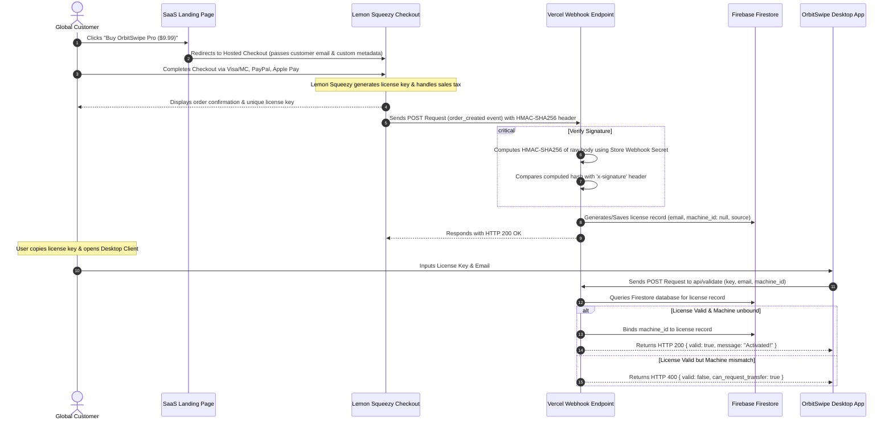

# 🍋 Lemon Squeezy Master Payment & Licensing Integration Spec
> [!IMPORTANT]
> **AI INSTRUCTION & EXECUTIVE DIRECTIVE**: This document serves as the absolute, single-source-of-truth master specification and direct prompt blueprint for integrating the **Lemon Squeezy Global Payment Gateway & License Management System** with a Node.js/Vercel serverless backend and a Firebase Firestore database. 
> 
> *If you are an AI assistant receiving this document as a prompt:* Read this entire file carefully and construct the endpoints (`api/webhooks/lemon-squeezy.js`, `api/validate.js`) and database adapters strictly adhering to the schemas, HMAC-SHA256 signature verification standards, and activation limits defined herein.

---

## 🗺️ System Architecture & Workflow

The checkout, webhook hook delivery, and client-side license authorization pipelines operate according to the following sequence:



---

## 🗄️ Firebase Firestore Schema Blueprint

For the payment and licensing system to operate flawlessly, Firestore must maintain a `licenses` collection structured exactly as defined below:

### Collection: `licenses`
* **Document ID**: `license_key` (e.g., `ORBIT-XXXX-XXXX-XXXX`)
* **Fields**:
  ```json
  {
    "id": "string (Matches Document ID, unique license key generated by Lemon Squeezy)",
    "email": "string (Purchaser's verified billing email address)",
    "machine_id": "string | null (Unique hardware ID/fingerprint bound on first activation. Initially null)",
    "source": "string (Purchase origin tracker, e.g., 'Lemon Squeezy', 'Manual Nagad', 'bkash')",
    "created_at": "timestamp (ISO 8601 string or Firestore ServerTimestamp when the license was generated)",
    "status": "string ('active', 'revoked', 'expired')",
    
    "transfer_requested": "boolean (Set to true if user requests a machine reset/shift)",
    "requested_machine_id": "string | null (New machine ID target when a transfer is pending approval)",
    "requested_at": "timestamp | null (Timestamp when the transfer request was submitted)"
  }
  ```

---

## 🛠️ Backend Endpoint Specifications (Node.js / Express / Vercel Serverless)

### 1. Webhook Processor: `api/webhooks/lemon-squeezy.js`
This endpoint consumes Lemon Squeezy webhooks to automatically parse new orders, capture generated license keys, and write records to Firestore.

> [!WARNING]
> **HMAC-SHA256 Security Rule**: You MUST verify the incoming webhook signature. If the header `x-signature` is missing or does not match the computed raw request body digest using your store webhook secret, reject the payload immediately with `HTTP 401 Unauthorized`.

#### Code Blueprint:
```javascript
const crypto = require('crypto');
const admin = require('firebase-admin');

// Ensure Firebase is initialized
if (!admin.apps.length) {
  admin.initializeApp({
    credential: admin.credential.cert(JSON.parse(process.env.FIREBASE_SERVICE_ACCOUNT))
  });
}
const db = admin.firestore();

module.exports = async (req, res) => {
  if (req.method !== 'POST') {
    res.setHeader('Allow', 'POST');
    return res.status(405).end('Method Not Allowed');
  }

  // 1. Signature Verification Flow
  const secret = process.env.LEMON_SQUEEZY_WEBHOOK_SECRET;
  const signature = req.headers['x-signature'];

  if (!signature) {
    return res.status(401).json({ error: 'Missing x-signature header' });
  }

  // Node.js: Compute raw body digest
  const rawBody = req.rawBody || JSON.stringify(req.body);
  const hmac = crypto.createHmac('sha256', secret);
  const digest = Buffer.from(hmac.update(rawBody).digest('hex'), 'utf8');
  const checksum = Buffer.from(signature, 'utf8');

  if (digest.length !== checksum.length || !crypto.timingSafeEqual(digest, checksum)) {
    return res.status(401).json({ error: 'Signature mismatch' });
  }

  const payload = req.body;
  const eventName = payload.meta.event_name;

  // 2. Event Routing
  if (eventName === 'order_created') {
    try {
      const attributes = payload.data.attributes;
      
      // Extract license key (Lemon Squeezy bundles generated licenses inside the relationship attributes)
      const licenseKey = payload.data.relationships.license_keys?.data?.[0]?.id || 
                         attributes.first_order_item?.license_keys?.[0]?.key ||
                         `ORBIT-${Math.random().toString(36).substring(2, 10).toUpperCase()}`;

      const customerEmail = attributes.user_email;
      const orderSource = 'Lemon Squeezy';

      // Save to Firestore Database
      const licenseRef = db.collection('licenses').doc(licenseKey);
      await licenseRef.set({
        id: licenseKey,
        email: customerEmail,
        machine_id: null, // Unbound, ready for client first-use
        source: orderSource,
        created_at: new Date().toISOString(),
        status: 'active',
        transfer_requested: false,
        requested_machine_id: null,
        requested_at: null
      });

      console.log(`Successfully registered license key: ${licenseKey} for ${customerEmail}`);
      return res.status(200).json({ success: true, licenseKey });
    } catch (err) {
      console.error('Database write failure:', err);
      return res.status(500).json({ error: 'Database update failed' });
    }
  }

  // Return HTTP 200 for other webhooks to keep signature channel healthy
  return res.status(200).json({ received: true });
};
```

---

### 2. Client Activation Router: `api/validate.js`
Handles active validation checks, registers machine fingerprints, and triggers the dynamic device transfer protocol.

#### Code Blueprint:
```javascript
const admin = require('firebase-admin');

if (!admin.apps.length) {
  admin.initializeApp({
    credential: admin.credential.cert(JSON.parse(process.env.FIREBASE_SERVICE_ACCOUNT))
  });
}
const db = admin.firestore();

module.exports = async (req, res) => {
  if (req.method !== 'POST') {
    return res.status(405).end('Method Not Allowed');
  }

  const { key, email, machine_id, request_transfer } = req.body;

  if (!key || !email || !machine_id) {
    return res.status(400).json({ valid: false, message: "Missing required license payload" });
  }

  try {
    const licenseRef = db.collection('licenses').doc(key.trim());
    const doc = await licenseRef.get();

    if (!doc.exists) {
      return res.status(404).json({ valid: false, message: "License key not found in active database" });
    }

    const data = doc.data();

    // Verify email matches key
    if (data.email.toLowerCase() !== email.toLowerCase()) {
      return res.status(400).json({ valid: false, message: "Billing email mismatch" });
    }

    if (data.status === 'revoked') {
      return res.status(403).json({ valid: false, message: "This license has been deactivated" });
    }

    // Case 1: First Activation (unbound machine_id)
    if (!data.machine_id) {
      await licenseRef.update({ machine_id: machine_id });
      return res.status(200).json({ valid: true, message: "Activation successful! Machine bound." });
    }

    // Case 2: Machine matched perfectly
    if (data.machine_id === machine_id) {
      return res.status(200).json({ valid: true, message: "License active & verified." });
    }

    // Case 3: Device mismatch - handles transfer protocol
    if (request_transfer) {
      // Record a new pending shift request
      await licenseRef.update({
        transfer_requested: true,
        requested_machine_id: machine_id,
        requested_at: new Date().toISOString()
      });
      return res.status(200).json({
        valid: false,
        can_request_transfer: true,
        message: "Transfer request submitted. Typically approved within 24 hours."
      });
    }

    // Return mismatch response (client UI will display the "REQUEST TRANSFER" option)
    return res.status(400).json({
      valid: false,
      can_request_transfer: true,
      message: "License is registered to another PC. Please submit a transfer request."
    });

  } catch (err) {
    return res.status(500).json({ valid: false, message: "SaaS server lookup failure" });
  }
};
```

---

## 🍋 Lemon Squeezy Portal Walkthrough & Configuration

To activate your production store on the Lemon Squeezy dashboard, follow these direct operational steps:

### 1. Store Currency & Profile
1. Navigate to [Lemon Squeezy](https://www.lemonsqueezy.com) and create an administrative account.
2. In **Store Settings**, name your store `OrbitSwipe Store` and configure **Currency** to **USD ($)**.
3. Submit the store for activation. Complete the onboarding compliance questionnaire (MoR registration requires a payout bank account to dispatch your funds).

### 2. Creating the Licensing Product
1. Navigate to the **Products** tab and click **New Product**.
2. **Title**: Set to `"OrbitSwipe Pro"`.
3. **Price Type**: Set to **Single payment**.
4. **Amount**: Set to `$9.99` (or your preferred global tier).
5. **License Keys (Mandatory Switch)**:
   * Toggle the **Generate license keys** switch to **ON**.
   * Under configuration, set **Activation Limit** to **`1`** (forces clients to use the single machine hardware binding system).
   * Leave product redirects pointing to your home site: `https://orbitswipe.vercel.app`.

### 3. Setting Up the Webhook Endpoint
1. Go to **Settings** -> **Webhooks**.
2. Click **Add Webhook** in the top right.
3. **Callback URL**: Enter `https://orbitswipe.vercel.app/api/webhooks/lemon-squeezy` (replace with your primary Vercel production domain).
4. **Signing Secret**: Generate a cryptographically secure random string (e.g., via `openssl rand -hex 24` or a password manager) and write it down.
5. **Webhook Events**: Select **`order_created`**.
6. Save Webhook.

---

## 🔐 Vercel Environment Variables Configuration

Deploy the following key-value pairs inside your Vercel Dashboard (`Settings` -> `Environment Variables`):

| Variable Name | Required Value | Purpose |
| :--- | :--- | :--- |
| `LEMON_SQUEEZY_WEBHOOK_SECRET` | Webhook secret configured in Lemon Squeezy portal | Validates payload integrity via HMAC-SHA256 |
| `FIREBASE_SERVICE_ACCOUNT` | Entire JSON service account credential string | Authorizes serverless functions to read/write Firestore |
| `ADMIN_PASSWORD` | Secure administrative dashboard access passcode | Preserves security checks on the enterprise admin portal |

---

## 🧪 Testing Checklist (Sandbox Verification Plan)

When integrating the code using another AI or test suite, execute the following QA scenarios:

### Scenario 1: Webhook Payload Validation
1. Use Lemon Squeezy's "Send Test Webhook" feature or send a raw POST request with a dummy payload using Postman.
2. Verify that sending an incorrect `x-signature` returns `HTTP 401 Unauthorized` instantly.
3. Verify that sending a valid signature writes a document with matching key, status `'active'`, and `machine_id: null` to your Firestore `licenses` collection.

### Scenario 2: First-Use Client Machine Binding
1. Send a POST request to `api/validate` containing a newly created key and machine fingerprint `PC-MAC-A`.
2. Confirm the database binds the machine ID instantly and returns `valid: true`.
3. Send the same request again. Confirm it validates with `valid: true` and does not overwrite anything.

### Scenario 3: Device Mismatch & Transfer Flow
1. Send a POST request to `api/validate` using the same key but fingerprint `PC-MAC-B`.
2. Confirm the server returns `valid: false` and `can_request_transfer: true`.
3. Send the request with the `request_transfer: true` parameter appended.
4. Verify the database successfully populates `transfer_requested: true` and sets `requested_machine_id` to `PC-MAC-B`.
5. Log into the Vercel Admin Dashboard (`/admin-dashboard`), refresh, and verify the shift request appears under **Pending Device Shift Requests**. Click **Approve** and confirm that `machine_id` shifts to `PC-MAC-B` instantly, resetting the transfer status!
